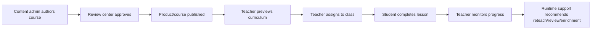
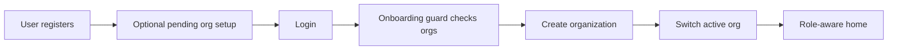
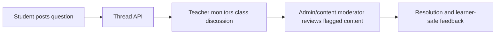
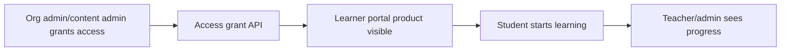

# Cross-Role Workflows

## Course to Classroom

Backend compatibility: supported by existing course/version/review/product, assignment, progress, and analytics APIs.

## Organization Onboarding

Backend compatibility: supported by `auth`, `orgs`, `PermissionsService`, and onboarding helpers.

## Discussion and Moderation

Gap: backend `posts.py` and `threads.py` exist, but full UI and moderation workflow are not clearly implemented.

## Access Grants

Design warning: avoid commercial/marketplace framing in community project UI.
