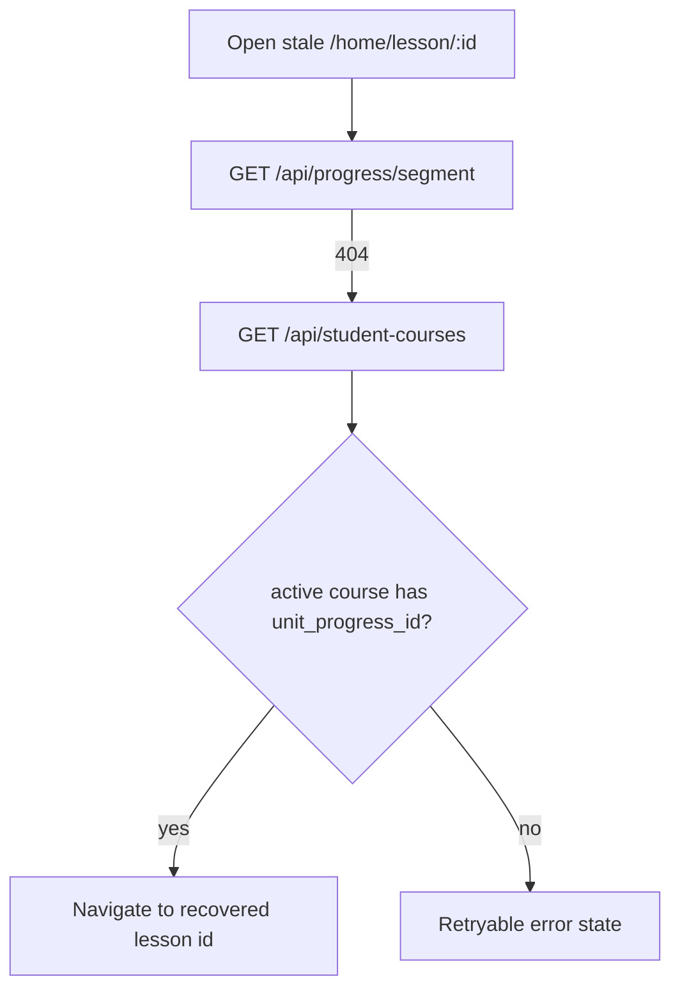

# Current User Journeys

## Student: Sign In to Lesson

```mermaid
flowchart TD
  A[Open /login] --> B[POST /api/auth/token]
  B --> C[PermissionsService bootstrap]
  C --> D{Ready or onboarding?}
  D -->|ready| E[/home]
  D -->|onboardingRequired| F[/onboarding/organization]
  E --> G[UserDashboard student view]
  G --> H[GET /api/student-courses]
  H --> I[Start/resume course]
  I --> J[POST /api/start-course or GET /api/progress/segment]
  J --> K{governed_available?}
  K -->|yes| L[/home/lesson/:unitProgressId]
  K -->|no| M[Unavailable state]
  L --> N[GET /api/lessons/:id]
  N --> O[Complete lesson]
  O --> P[POST /api/progress/segment/complete]
```

Problems: default route is `/home`, not canonical `/learn`; route is governed but labels do not explain why a lesson is paused.

## Student: Interrupted Lesson Recovery



Strength: recovery exists and is covered by tests.

## Teacher: Assign Learning

```mermaid
flowchart TD
  A[Sign in] --> B[/home teacher dashboard]
  B --> C[GET /api/courses]
  B --> D[GET /api/users/students]
  B --> E[GET /api/analytics/teacher-summary]
  C --> F[Select course]
  D --> G[Select student]
  F --> H[POST /api/assign-course]
  G --> H
  H --> I[Toast success/error]
```

Problems: assignment is embedded in a dense dashboard rather than a dedicated guided workflow.

## Teacher: Manage Class

```mermaid
flowchart TD
  A[/home/sections] --> B[GET /api/sections]
  B --> C[/home/sections/:id]
  C --> D[GET /api/sections/:id/roster]
  C --> E[GET /api/sections/:id/assignments]
  C --> F[POST /api/sections/:id/enrollments]
  C --> G[POST /api/sections/:id/assignments]
```

Problems: the user-facing label should be "Classes"; assignment creation needs better validation and preview.

## Admin: Manage Users

```mermaid
flowchart TD
  A[/home/admin/users] --> B[GET /api/users]
  B --> C[Filter/review users]
  C --> D[PUT /api/users/:id]
  C --> E[DELETE /api/users/:id]
```

Problems: confirmation/audit-sensitive states need standardization.

## Content Admin: Review Content

```mermaid
flowchart TD
  A[/workspace/review-center] --> B[GET /api/review-center]
  B --> C[Open product or artifact]
  C --> D[PATCH review-status]
  D --> E[Updated queue]
```

Problems: content/admin workflows share generic workspace nav with teachers and instructors.
