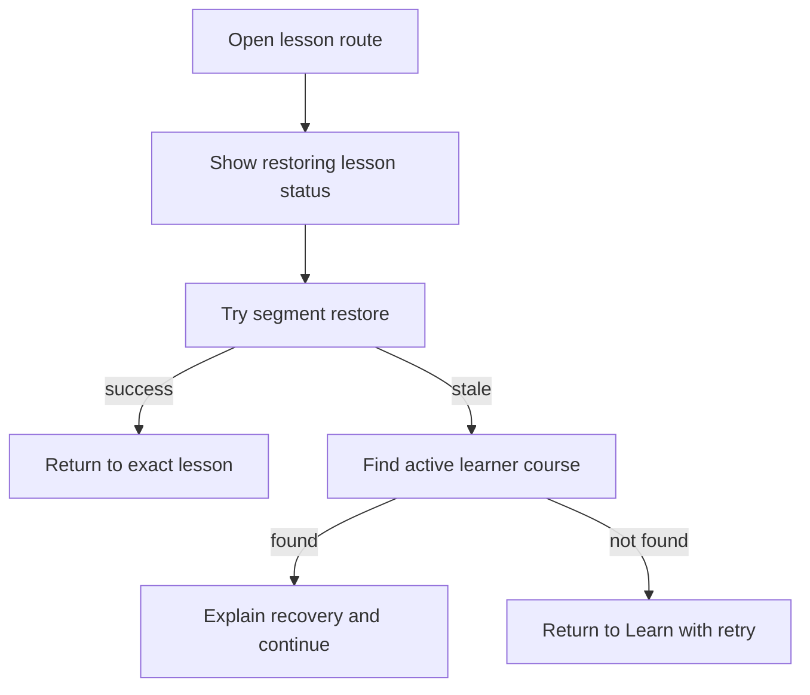
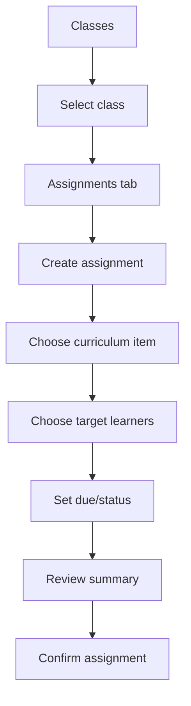
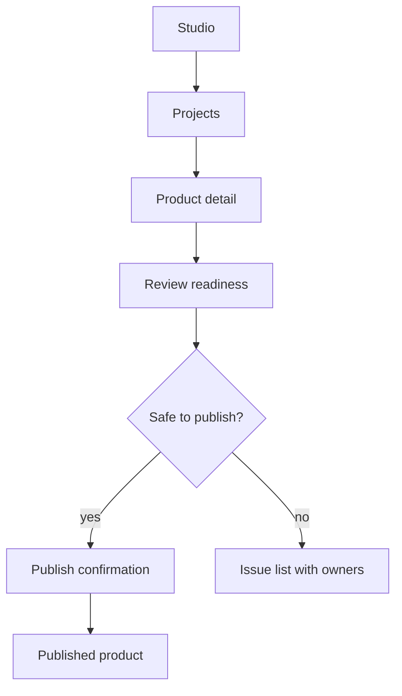
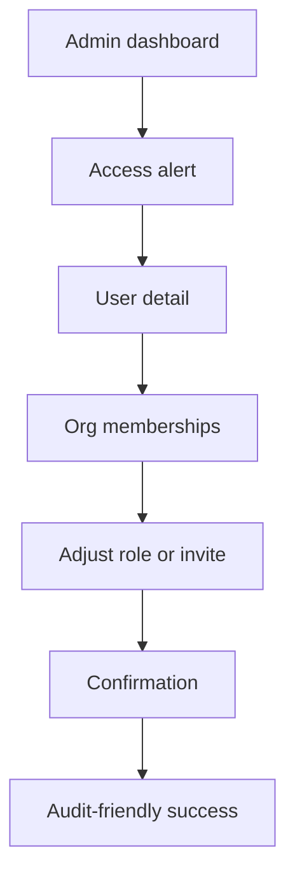

# Proposed User Journeys

## Student: Resume Learning

```mermaid
flowchart TD
  A[Sign in] --> B[Resolve role and active org]
  B --> C[/learn]
  C --> D[Next learning card]
  D --> E{Assigned or self-selected?}
  E -->|assigned| F[Open assignment context]
  E -->|self-selected| G[Open course overview]
  F --> H[Start/resume lesson]
  G --> H
  H --> I[Lesson player]
  I --> J[Activity/assessment]
  J --> K[Completion feedback]
  K --> L[Progress and next recommendation]
```

Design requirements: next action first, lesson status visible, safe exit sticky on mobile, live progress feedback.

## Student: Recover Interrupted Session



Design requirements: do not show raw IDs, explain recovery in student-safe copy.

## Teacher: Start Day

```mermaid
flowchart TD
  A[Sign in] --> B[/teach]
  B --> C[Today's priorities]
  C --> D[Learners needing support]
  C --> E[Recent submissions]
  C --> F[Upcoming assignments]
  D --> G[Open class detail]
  E --> H[Review work]
  F --> I[Edit or assign learning]
```

Design requirements: class context visible; intervention recommendations linked to evidence and next teacher action.

## Teacher: Assign Learning



Design requirements: reuse existing sections/assignments APIs; no new backend contract required for initial guided UI.

## Content Admin: Publish Content



Design requirements: source provenance, review status, safe-publish issues, learner impact warnings.

## Admin: Resolve Access Issue



Design requirements: destructive/privileged actions require confirmation and clear role definitions.
