# Proposed Sitemap

## Preserve First, Restructure Gradually

| Proposed area | Route strategy | Notes |
| --- | --- | --- |
| Learn | Preserve `/learn/**`; redirect student `/home` to `/learn` after preference migration. | Canonical student experience. |
| Teach | Add frontend route aliases later; initially relabel existing `/home/sections`, teacher dashboard, assignments. | Existing APIs support it. |
| Studio | Preserve `/workspace/**` for content operations; hide irrelevant nav per role. | Keep product/source/artifact routes. |
| Organization | Initially conceptual over `/workspace/settings/invites`, `/workspace/access`, `/home/sections`. | Dedicated routes optional later. |
| Admin | Initially conceptual over `/home/admin/*` and analytics. | Dedicated `/admin` route aliases optional. |
| Community | Relabel `/workspace/commercial`; later add `/community` alias and discussion UI. | Avoid backend change initially. |

```mermaid
flowchart TD
  App[EchoEd]
  App --> Public[Public]
  App --> Learn[Learn]
  App --> Teach[Teach]
  App --> Studio[Studio]
  App --> Org[Organization]
  App --> Admin[Admin]
  App --> Community[Community]

  Public --> PLanding[Landing]
  Public --> PCatalog[Public Products]
  Public --> PLogin[Login]
  Public --> PRegister[Registration]
  Public --> POnboarding[Organization Setup]

  Learn --> LHome[Learner Home]
  Learn --> LAssignments[Assignments]
  Learn --> LCourses[Courses]
  Learn --> LLesson[Lesson Player]
  Learn --> LProgress[Progress]
  Learn --> LAchievements[Achievements]
  Learn --> LResources[Resources]

  Teach --> TToday[Today]
  Teach --> TClasses[Classes]
  Teach --> TAssignments[Assignments]
  Teach --> TCurriculum[Curriculum]
  Teach --> TSupport[Learner Support]
  Teach --> TReports[Reports]

  Studio --> SHome[Studio Home]
  Studio --> SProjects[Projects]
  Studio --> SSources[Sources]
  Studio --> SArtifacts[Artifacts]
  Studio --> SProducts[Products]
  Studio --> SReview[Review]

  Org --> OPeople[People]
  Org --> OInvites[Invites]
  Org --> OAccess[Access]
  Org --> OSettings[Settings]

  Admin --> AHome[Admin Home]
  Admin --> AUsers[Users]
  Admin --> AOrgs[Organizations]
  Admin --> ACurriculum[Curriculum]
  Admin --> ABadges[Badges]
  Admin --> AReports[Reports]
  Admin --> AModeration[Moderation]

  Community --> CDiscuss[Discussions]
  Community --> CContrib[Contributor Guide]
  Community --> CResources[Shared Resources]
```

## Route Compatibility Notes

- Preserved physical routes: `/learn/**`, `/workspace/**`, `/home/admin/*`, `/home/sections`, `/home/lesson/:id`.
- Frontend route aliases recommended later: `/teach`, `/admin`, `/organization`, `/community`.
- Conceptual views over existing routes: Teacher Today, Learner Support, Organization Home, Admin Reports, Moderation.
- Backend changes required: none for IA shell phase.
